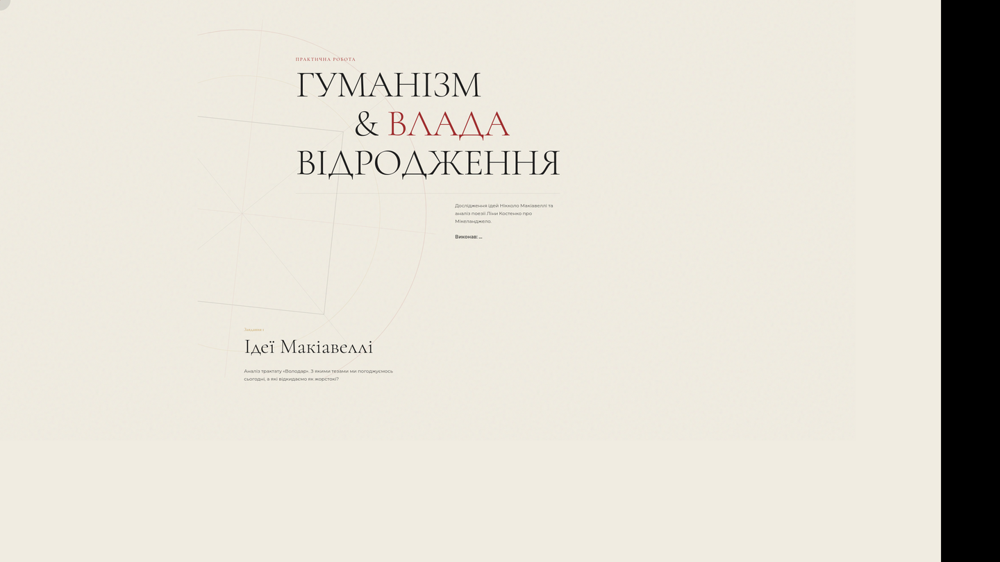

# Renaissance Ideas — History Page

## English
A visual static page about Renaissance ideas and historical context.

### Features
- Educational single-page layout.
- Smooth scrolling and animation effects.
- Historical content presentation.

### Screenshots

### Run locally
Use any static file server and open the project in a browser. Example: Python built-in HTTP server on port 8000.

## Русский
Визуальная статическая страница об идеях Ренессанса и историческом контексте.

### Возможности
- Educational single-page layout.
- Smooth scrolling and animation effects.
- Historical content presentation.

### Скриншоты

### Локальный запуск
Запусти любой статический HTTP-сервер и открой проект в браузере. Например, встроенный Python HTTP server на порту 8000.

## Українська
Візуальна статична сторінка про ідеї Ренесансу та історичний контекст.

### Можливості
- Educational single-page layout.
- Smooth scrolling and animation effects.
- Historical content presentation.

### Скріншоти

### Локальний запуск
Запусти будь-який статичний HTTP-сервер і відкрий проєкт у браузері. Наприклад, вбудований Python HTTP server на порту 8000.
